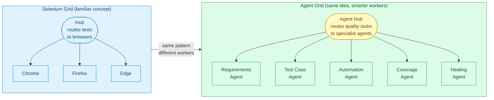
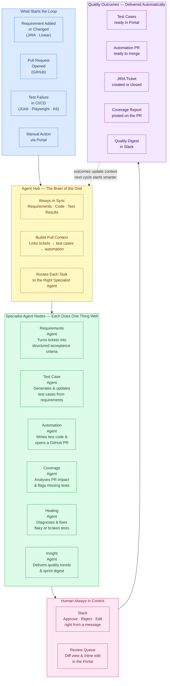
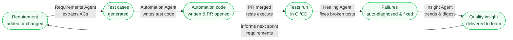
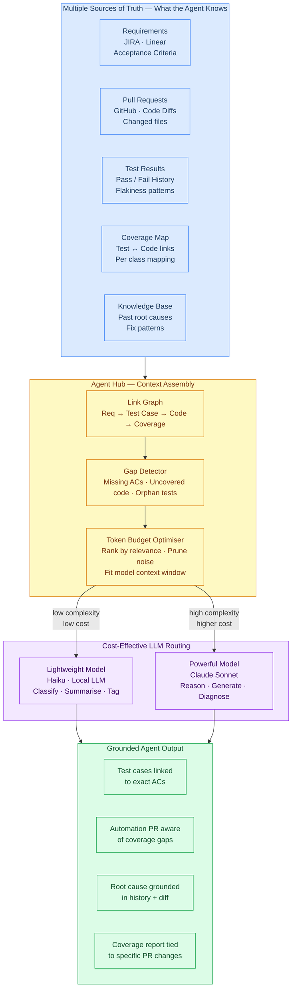

# End-to-End Agentic Quality Platform
## Powered by Agent Grid

---

## The Idea: Agent Grid (Selenium Grid, but for AI)

> Same mental model QA engineers already know — a **Hub** that coordinates a pool of **specialist workers**.
> In Selenium Grid, workers are browsers. In Agent Grid, workers are AI agents.

---

## End-to-End Platform Flow

---

## The Continuous Quality Loop

---

## How Agents Reason — Multi-Source Context with Cost Control

> Agents don't generate from a single ticket. The Hub assembles a **linked knowledge graph** from every source of truth, detects gaps, prunes noise to fit the token budget, then routes each task to the right model.

---

## What the Team Sees

| Before Agent Grid | With Agent Grid |
|---|---|
| Engineer manually writes test cases from JIRA tickets | Agent reads ticket, extracts ACs, drafts test cases automatically |
| Automation is a separate project, always behind | Agent opens a test automation PR the same day as the feature PR |
| PR reviewer misses untested edge cases | Coverage Agent comments directly on the PR with gap analysis |
| Flaky tests cause noise for weeks | Healing Agent diagnoses and opens a fix PR within hours |
| QA lead spends Friday generating sprint quality reports | Insight Agent delivers the digest to Slack every morning |
| AI output goes unchecked into production | Every AI action requires human approval before it lands |
