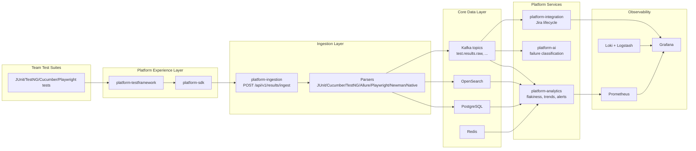

# Scaling Test Automation: From Framework to Platform

Time slot: 07:30 PM - 08:15 PM  
Talk: 35 minutes (07:30 PM - 08:05 PM)  
Q&A: 10 minutes (08:05 PM - 08:15 PM)

---

## 1) Opening (1 min)

Scaling Test Automation: From Framework to Platform

- Goal: show why frameworks alone stop scaling
- Approach: treat automation as shared platform infrastructure
- Demo: this repository (`test-automation-platform`)

---

## 2) Run of Show (1 min)

1. Problem at scale
2. Framework vs platform
3. Why move now
4. Architecture walkthrough (this project)
5. Demo
6. Trade-offs and adoption plan
7. Q&A

---

## 3) The Scaling Problem (3 min)

When teams scale with only framework thinking:

- Test execution slows as suites and environments grow
- Flaky behavior hides inside team-local pipelines
- Reporting fragments across JUnit/TestNG/Cucumber/Playwright outputs
- Failure triage becomes manual and repetitive
- Release risk is unclear at org level

Key point: local optimization at team level creates global blind spots.

---

## 4) Framework vs Platform (4 min)

| Dimension | Test Automation Framework | Test Automation Platform |
|---|---|---|
| Primary goal | Help a team write/run tests | Provide org-wide quality intelligence |
| Scope | Test code, runner, assertions, utilities | Ingestion, storage, analytics, AI, integrations, observability |
| Ownership | Usually one team | Shared service model across teams |
| Data model | Per-suite/per-tool format | Unified cross-framework schema |
| Output | Pass/fail per run | Trends, flakiness, alerts, ticket lifecycle |
| Failure handling | Manual | Automated classification + workflow |

In this repo:
- Framework: `platform-testframework`
- Platform entry SDK: `platform-sdk`
- Platform services: `platform-ingestion`, `platform-analytics`, `platform-ai`, `platform-integration`

---

## 5) Why Move On (3 min)

You outgrow framework-only mode when:

- Multiple teams use different stacks
- CI runtime and rerun costs climb
- Flaky tests block merges frequently
- MTTR for test failures is high
- Leadership asks for release-quality signals, not just test logs

Business shift:
- From "Can this team run tests?" to "Can the organization trust quality signals?"

---

## 6) Platform Contains the Framework (3 min)

The framework does not disappear. It becomes one layer of the platform.

```text
Platform = Framework + Data + Workflow + Observability + Intelligence

Framework layer (in this repo):
- platform-testframework: base test abstractions, Cucumber plugin, retry, context
- platform-sdk: framework adapters/publisher to ingestion API
```

Code anchor:
- `platform-testframework/src/main/java/.../PlatformBaseTest.java`
- `platform-sdk/src/main/java/.../PlatformReporter.java`

---

## 7) High-Level Architecture (5 min)



---

## 8) Event and Intelligence Flow (4 min)

1. Tests publish native/file-based results to ingestion
2. Ingestion normalizes to `UnifiedTestResult`
3. Persist to PostgreSQL + OpenSearch
4. Publish Kafka event (`test.results.raw`)
5. Consumers:
   - Analytics: flakiness scoring + quality gates + alerts
   - AI: optional real-time classification (cost-controlled by config)
   - Integration: create/update/close/reopen Jira tickets

Code anchors:
- `platform-ingestion/src/main/java/.../ResultIngestionService.java`
- `platform-analytics/src/main/java/.../ResultAnalysisConsumer.java`
- `platform-ai/src/main/java/.../AnalysisEventConsumer.java`
- `platform-integration/src/main/java/.../TicketLifecycleManager.java`

---

## 9) AI: Where It Helps vs Hurts (3 min)

Where AI accelerates:
- Faster failure categorization and suggested fixes
- Pattern grouping across repeated incidents
- Triage support for large failure volumes

Where AI can hurt:
- Cost spikes on every failed test
- Hallucinated root cause
- False confidence in low-signal failures

Guardrails in this repo:
- Real-time analysis toggle (`ai.realtime.enabled`)
- Compact prompts with capped stack/history
- Idempotent persistence to avoid duplicate analysis

---

## 10) Demo Plan (35-minute talk final 5 min)

Demo goal: prove framework-in-platform flow end to end using this repo.

### Setup
```bash
mvn install -DskipTests
docker compose up -d
docker compose --profile services up -d platform-ingestion platform-analytics platform-integration platform-ai
curl -s http://localhost:8081/actuator/health
```

### Run tests (framework + SDK publishing)
```bash
mvn test -pl saucedemo-tests
```

Expected artifact:
- `saucedemo-tests/target/surefire-reports/...` shows 13 tests run
- Logs show `[Platform SDK] Native result published`

### Verify platform persistence
```bash
docker exec platform-postgres psql -U platform -d platform -c \
"SELECT count(*) AS executions FROM test_executions;
 SELECT count(*) AS results FROM test_case_results;"
```

### Show observability
- Grafana: `http://localhost:3000`
- Dashboards in `infrastructure/grafana/dashboards/`

---

## 11) Trade-offs and Design Choices (1 min)

- Synchronous ingest + async analytics via Kafka
  - Pro: decoupled scaling
  - Con: eventual consistency across views
- Multi-store persistence (Postgres + OpenSearch + Redis)
  - Pro: right tool per workload
  - Con: operational complexity
- Framework-agnostic parsers + native SDK mode
  - Pro: low adoption friction
  - Con: schema/version governance required

---

## 12) Practical Migration Path (1 min)

1. Start by standardizing result ingestion schema
2. Add centralized dashboards and alerting
3. Add flakiness scoring + quality gates
4. Integrate issue lifecycle automation
5. Add AI analysis with strict guardrails

Success criteria:
- Faster triage, fewer duplicate tickets, stable CI signal quality

---

## 13) Key Takeaways (1 min)

- Framework is necessary but not sufficient at scale
- Platform thinking turns tests into organizational quality telemetry
- Keep your framework; wrap it in shared services and observability
- This project demonstrates the full path from execution to actionable outcomes

---

## 14) Q&A (10 min, 08:05 PM - 08:15 PM)

Prompt ideas:
- What should stay in team frameworks vs platform core?
- How to phase rollout without slowing delivery?
- Where should AI be gated by policy/cost?
