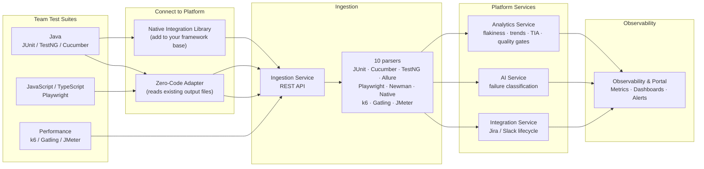

# Scaling Test Automation: From Framework to Platform

---

## 1) Agenda

1. **The scaling problem** — what frameworks can't solve alone
2. **Building the right framework foundation** — five design decisions that compound over time
3. **From framework to platform — the shift**
   - Framework vs Platform: what changes and what stays
   - Why move now: the signals that tell you it's time
4. **Platform architecture**
   - How the pieces connect — services, parsers, event bus
   - The open-source stack — every component, zero vendor lock-in
   - Two ways to connect your framework — adapter vs native library
5. **Platform capabilities** — flakiness, TIA, quality gates, tickets, AI controls
6. **AI — where it helps and where it hurts** — accelerators, risks, and guardrails
7. **Demo — end-to-end: from test run to platform insight**
   - A: Zero-code connection (`platform-adapters`)
   - B: Native integration (`platform-testkit-java`)
   - C: Test Impact Analysis
   - D: Performance test in the same pipeline (k6)
   - E: AI Settings — provider switch, real-time toggle, on-demand analysis
   - F: Verify in Portal and DB
8. **Trade-offs and migration path**
   - Design choices and their costs
   - Phased adoption — step by step
9. **Key takeaways**
10. **The next frontier — Agentic AI** — generate, execute, evaluate, maintain, repeat
11. **Q&A**

---

## 2) About Me

- **Role:** QA Architect / Platform Engineer
- Building test automation infrastructure across multiple teams and stacks
- Focused on turning per-team quality data into org-wide quality intelligence
- Open-source contributor — everything in this talk runs on freely available tools

---

## 3) The Scaling Problem

*What a QA Architect actually lives with as the organisation grows*

| What you feel | What is actually missing |
|---|---|
| CI is slow and getting slower | No test selection — every run executes everything, every time |
| Flaky tests eroding trust in CI | Flakiness is invisible until it has already caused damage |
| A test goes from 2% to 20% fail rate over four weeks — nobody notices until it blocks a release | No trend line — degradation is silent without historical pass rate per test |
| Failure triage takes hours | Each team diagnoses in isolation — no cross-team pattern recognition |
| Recurring failures with no owner | No automated link between a failing test and a work item — things get missed or silently ignored |
| Can't answer "are we release-ready?" | No org-level quality signal — only team-level noise |
| "Is our quality improving?" — answered with gut feel, not data | No quarter-over-quarter baseline — progress is invisible to leadership and the team alike |
| Functional and non-functional tests live in separate worlds — no single report covers both | Teams run JUnit, Cucumber, Playwright, k6, JMeter — each produces a different format, each has its own dashboard, quality is never seen as a whole |

**The pattern underneath all of it:**

> Each team optimises locally. Quality data is trapped in silos.
> The problem is not the frameworks — it is the absence of a shared signal layer above them.

---

## 4) Building the Right Foundation

*Design your framework for scale before the platform layer*

### Five design decisions that compound over time

**1. Layered modules, not a monolithic jar**

Every concern is its own published library — UI interactions, API, configuration, reusable utilities/helpers. Downstream projects declare only what they need. No duplication, no hidden coupling.

```
┌────────────────────────────────────────────────────────────────────────-─┐
│  SHARED LAYER  (published to GitHub Packages — versioned, immutable)     │
│                                                                          │
│  test-parent-pom                  ← dependency versions + plugin config  │
│  └── test-automation-fwk                                                 │
│          └── test-libraries                                              │
│                  ├── test-libraries-utilities   config · YAML · helpers  │
│                  ├── test-libraries-webui       Selenium UI              │
│                  ├── test-libraries-api         REST (rest-assured)      │
│                  └── ...                                                 │
│                                                                          │
│  platform-testkit-java            ← @Step · @Retryable · @AffectedBy     │
│                                     OTel tracing · result publish        │
└────────────────────────────────────────────────────────────────────────-─┘
           │                                    │
           │ declares only what it needs        │ declares only what it needs
           ▼                                    ▼
┌──────────────────────────┐      ┌──────────────────────────┐
│  automation-team-alpha   │      │  automation-team-beta    │
│  (Gradle · TestNG · UI)  │      │  (Gradle · TestNG · API) │
│                          │      │                          │
│  test-libraries-webui    │      │  test-libraries-api      │
│  platform-testkit-java   │      │  platform-testkit-java   │
│                          │      │                          │
│  ← no UI lib duplicated  │      │  ← no API lib duplicated │
│  ← no platform SDK copy  │      │  ← no platform SDK copy  │
└──────────────────────────┘      └──────────────────────────┘
```

Each team repo has **zero shared code of its own** — it pulls versioned libraries from the shared layer and writes only test logic. Upgrading the framework or SDK means bumping one version in one place.

**2. Externalized locators — the object repository pattern**

Locators live in YAML files, not in code. Each entry is a dot-notation path into a hierarchy. The locator type is declared by prefix (`xpath=`, `cssselector=`, `id=`, `role=`, …); no prefix defaults to XPath. FreeMarker `${variable}` syntax enables a single entry to cover all dynamic variations. Primary + fallback lists give the framework self-healing behaviour — if the primary locator fails, the next is tried automatically.

```yaml
Shared:
  Payment Frame: id=payment-iframe

Checkout:
  Payment:
    Option:
      primary: cssselector=a[role="option"][data-value="${value}"]
      fallbacks:
        - xpath=//a[normalize-space()="${value}"]
        - id=option-${value}
      parent:
        frameRef: Shared.Payment Frame
```
```java
findTestObject("Checkout.Payment.Option", Map.of("value", "Credit Card"))
// one entry — parameterized, self-healing, iframe-aware
```

One entry covers parameterization (`${value}`), self-healing fallbacks, and a reusable parent reference — no duplication, no extra code in tests.

**3. Configuration cascade — no hardcoded environment values**

A single resolution strategy, applied at every entry point:

```
System properties  →  environment variables  →  ordering files  →  base config
```

`ConfigurationManager` is a ThreadLocal singleton — each parallel thread resolves its own isolated config. Teams override per environment without touching shared files.

**4. Facade + Factory — the same API across all test stacks**

Two static facades — `WebUI` for browser tests, `RestAssured` for API tests — give every team a single, stable call surface. The factory chain underneath resolves the target (local, remote Grid, containerised) and authentication strategy from configuration alone. Test code never references a specific driver or HTTP client directly.

```
WebUI.click(...)          RestAssured.post(...)
      │                          │
      ▼                          ▼
 TargetFactory              TargetFactory (API)
  └─ BrowserFactory enum     └─ AuthenticationStrategyFactory
      ├─ CHROME                   ├─ Bearer token
      ├─ FIREFOX                  ├─ Basic auth
      ├─ EDGE                     └─ None
      └─ SAFARI
  └─ RemoteDriverFactory      └─ RequestSpecification
      └─ Selenium Grid               (headers, base URL, auth)
```

**`automation-team-alpha` — UI tests call `WebUI` through page objects:**

```java
// CheckboxesPage.java — inside test-automation-fwk shared layer
public class CheckboxesPage {
    public void navigateTo(String baseUrl) {
        WebUI.navigateToUrl(baseUrl + "/checkboxes");   // facade
        WebUI.waitForPageLoaded(10);
    }
    public boolean isCheckbox1Checked() throws Exception {
        return WebUI.isChecked(ObjectRepository.findTestObject("Checkboxes Page.Checkbox 1"));
    }
}

// BaseTest.java — @BeforeMethod wires the factory once
WebUI.openBrowser(browser, BASE_URL);   // TargetFactory → BrowserFactory(CHROME/FIREFOX/EDGE)
                                        // or → RemoteDriverFactory → Selenium Grid
                                        // resolved from ConfigurationManager — no code change
```

**`automation-team-beta` — API tests call `RestAssured` through client objects:**

```java
// CatalogClient.java — inside test-automation-fwk shared layer
public class CatalogClient {
    public Response createProduct(CreateProductRequest req) {
        return RestAssured.post("/api/v1/products", req);   // facade
    }
    public Response adjustInventory(String sku, int delta) {
        return RestAssured.patch("/api/v1/products/" + sku + "/inventory",
                                 new AdjustInventoryRequest(delta));
    }
}

// BaseApiTest.java — @BeforeMethod wires session once
RestAssured.openSessionWithBearerToken(BASE_URL, BEARER_TOKEN);
// TargetFactory → RequestSpecification (headers, content-type, auth)
// → AuthenticationStrategyFactory resolves Bearer / Basic / None from config
```

Same test-author experience across both stacks. No `new ChromeDriver()`, no `given().header(...)` boilerplate — just the domain action.

**5. Container-first execution — offline, reproducible, CI-ready**

The image chain is built once and published. Every CI run pulls a versioned image — no network fetches, no credential leaks at runtime. The execution target (local browser, Selenium Grid, AUT endpoint) is resolved from configuration; test code never changes.

```
maven:3.9.11-eclipse-temurin-21          ← JDK 21 + Maven + Gradle
    └── ndviet/test-automation-java-common  ← framework JARs + pre-seeded .m2
            └── automation-team-alpha:sha  ← Gradle deps cached + test classes pre-compiled
            └── automation-team-beta:sha   ← same pattern, API test classes
```

**What gets baked in at each layer:**

```
ndviet/test-automation-java-common
  ├─ Maven repo pre-seeded (no mvn download in CI)
  └─ Framework JARs: test-libraries-webui, test-libraries-api, …

automation-team-alpha image (built in CI — linux/amd64 + linux/arm64)
  ├─ Gradle dependency cache (GPR auth at build time only — not in final image)
  ├─ SNAPSHOT cache frozen (init.d script — Gradle never hits network at runtime)
  └─ Test classes pre-compiled — ./gradlew testClasses baked in

automation-team-beta image (same multi-arch pattern)
  ├─ Gradle dependency cache + SNAPSHOT freeze
  └─ Test classes pre-compiled
```

**How CI uses the image — team-alpha (UI tests):**

```bash
# Job 1 — build once, push to GHCR
docker buildx build --platform linux/amd64,linux/arm64 \
  --build-arg BASE_IMAGE=ndviet/test-automation-java-common:latest \
  --push -t ghcr.io/org/automation-team-alpha:$SHA .

# Job 2 — pull image, start Selenium Grid, run tests (no build, no download)
docker compose up -d --wait --wait-timeout 180   # hub + chrome + firefox + edge nodes
docker run --rm --network automation-grid_default \
  -e APP_URL=https://the-internet.herokuapp.com \
  ghcr.io/org/automation-team-alpha:$SHA \
  ./gradlew test --no-daemon \
    -Dselenium.web_driver.target=REMOTE \
    -Dselenium.hub.url=http://selenium-hub:4444/wd/hub
```

**How CI uses the image — team-beta (API tests):**

```bash
# Job 2 — pull image, start AUT stack (postgres + Spring Boot backend), run tests
docker compose up -d --wait   # postgres:16 + ghcr.io/ndviet/aut-api-testing:latest
docker run --rm --network automation-api-stack_default \
  ghcr.io/org/automation-team-beta:$SHA \
  ./gradlew test --no-daemon \
    -Dapi.base.url=http://aut-backend:8080
```

Same image runs on a developer laptop (`docker compose --profile test up`) and in the pipeline. Credentials are needed only at image build time — never at test runtime.

### The pattern this enables

The same locator files, the same configuration cascade, and the same `WebUI` facade are shared across all test frameworks in the organisation. New stacks are onboarded by adding an adapter layer — not by rewriting shared logic.

> This is also language-agnostic. The same architecture scaffolds in Python or TypeScript in hours — feed the design as a spec to an LLM and generate the equivalent. This is how the Playwright adapter for the platform was built.

---

## 5) Framework vs Platform

*The platform does not replace the framework — it wraps it*

| Dimension | Test Automation Framework | Test Automation Platform |
|---|---|---|
| Primary goal | Help a team write and run tests | Provide org-wide quality intelligence |
| Scope | Test code, runner, assertions, utilities | Ingestion, analytics, AI, integrations, observability |
| Ownership | One team | Shared service across all teams |
| Data model | Per-tool format (XML, JSON, JTL) | Unified schema — every framework, one pipeline |
| Output | Pass / fail per run | Trends, flakiness scores, alerts, ticket lifecycle |
| Failure handling | Manual triage | Automated classification + workflow automation |
| Performance data | Separate load test reports | Same pipeline as functional tests |
| Test selection | Run everything, every time | Test Impact Analysis — run only what matters |

**The framework is one layer. The platform adds the layers above it.**

---

## 6) Why Move Now

*You outgrow framework-only mode at a predictable point*

Move when you see **three or more** of these:

- Multiple teams using different test stacks (JUnit, Cucumber, Playwright, k6)
- CI runtime growing faster than the team count
- Flaky tests blocking merges more than once per week
- Failure MTTR measured in hours, not minutes
- Leadership asking for release readiness signals — not test logs
- Functional and non-functional tests reported separately — no unified quality picture

**The business shift:**
> *From "Can this team run tests?" → "Can the organisation trust quality signals?"*

---

## 7) Platform Architecture

*How the pieces connect*



---

## 8) The Stack Behind It — All Free, All Open-Source

*No vendor lock-in. Every component has a managed cloud equivalent if you need it.*

| Layer | Tool | What it does |
|---|---|---|
| **API & Services** | Spring Boot 4 · Spring WebFlux | REST APIs, async processing |
| **Message bus** | Apache Kafka (KRaft) | Decouples ingestion from analytics, AI, and integrations |
| **Primary store** | PostgreSQL 17 | Test results, flakiness scores, tickets, audit log |
| **Search & similarity** | OpenSearch 3 | Full-text failure search, k-NN root-cause grouping |
| **Cache** | Redis 8 | Quality gate results, rate limiting, session tokens |
| **Observability** | Prometheus + Grafana | Metrics, dashboards, alert rules |
| **Tracing** | OpenTelemetry + Jaeger | Distributed trace per test run |
| **Containerisation** | Docker Compose → Kubernetes + Helm | Same config from laptop to prod |
| **CI integration** | GitHub Actions · GitLab CI · Jenkins | TIA filters, result upload, quality gates |

> **The platform runs on a developer laptop with one command:** `docker compose --profile services up -d`

---

## 9) Two Ways to Connect Your Framework

*Choose based on how much you want to change*

| | Native Integration Library | Zero-Code Adapter |
|---|---|---|
| **What it is** | Add to your framework base — deep, native integration | Reads existing report output files — no test code changes |
| **Code change** | Add one dependency to your framework base; optional annotations on tests | Register one listener / extension / reporter |
| **What you get** | `@Step` AOP tracking (auto-named, nested, param-interpolated), distributed tracing, `@Retryable`, `@AffectedBy` coverage, failure hints | Automatic upload of existing XML / JSON report files |
| **Best for** | New frameworks or teams wanting full observability | Existing projects with no appetite for code change |
| **Language** | Java today · Python, JavaScript planned | Java · JavaScript / TypeScript |

**Rule of thumb:** start with the zero-code adapter today, migrate to the native library when you want richer data.

---

## 10) What the Platform Does With Your Test Results

*Capabilities across four service areas*

### Flakiness & Trends
- Scores every test: Stable · Watch · Flaky · Critical Flaky
- Tracks pass rate, duration, and failure patterns over time
- Org-wide dashboard across all teams and frameworks

### Test Impact Analysis

Data flows from annotation → ingestion → coverage table → impact query → CI filter, automatically:

```
@AffectedBy({"com.example.PaymentService"})   ← declared once in test or step class
       │
       ▼  PlatformExtension.beforeEach() — reads annotation, stores in TestContext
       │
       ▼  afterEach() — snapshot() → NativeReportPublisher → multipart POST /ingest
       │
       ▼  CoverageIngestionService — upsert(projectId, testCaseId, className)
       │
       ▼  DB: test_coverage_mappings (projectId · testCaseId · className · lastSeenAt)
       │
       ▼  GET /api/v1/analytics/{projectId}/impact?changedFiles=...
       │   TestImpactService:
       │     1. file path → fully qualified class name
       │     2. findByProjectIdAndClassNameIn(classesToCheck)
       │     3. group by test ID, compute risk + reduction %
       │     4. build Maven / Gradle filter strings
       │
       ▼  TestImpactResult { recommendedTests, riskLevel, estimatedReduction,
                             mavenFilter, gradleFilter, uncoveredChangedClasses }
       │
       ├─→ Portal: TestImpactPanel — risk badge, metrics, copyable filter commands
       └─→ CI: feed mavenFilter / gradleFilter into the test run command
```

**Risk levels:** `LOW` (all classes mapped) · `MEDIUM` (80%+ mapped) · `HIGH` (50%+) · `CRITICAL` (<50% — run full suite)

**What the portal shows per project:**
- Coverage health: `N tests mapped · M classes` — indicates TIA readiness
- Paste changed file paths → instant risk level + recommended test list
- Copy Maven (`-Dtest=...`) or Gradle (`--tests ...`) filter — one click to CI

### Quality Gates & Alerts
- Configurable thresholds: max failure rate, max flaky %, min pass rate
- Alert channels: email, Slack, webhook
- Release report: go / no-go signal per environment

### Automated Ticket Lifecycle
- Confirmed application bug with repeated failures → creates Jira Bug automatically
- Test with rising flakiness → creates Test Maintenance ticket
- Test back to green → closes the ticket (opt-in per team)
- Deduplication groups the same root cause into one ticket, not many

### AI Analysis Controls (Portal → AI Settings)
- **Real-time toggle:** enable or disable automatic failure classification on every incoming run — change takes effect immediately, no service restart
- **On-demand trigger:** "Analyze Now" button re-classifies all unanalysed failures from the last 24 hours — useful after configuring an API key or switching providers
- **Provider & key hot-swap:** switch between Claude and OpenAI, or update API keys, from the Portal — the AI service picks up the new config on the next analysis call without restarting

---

## 11) AI — Where It Helps and Where It Hurts

*Honest assessment*

### Where it accelerates
- Pre-classifies failures before a human looks — bad locator, timing issue, infrastructure noise, or real application bug
- Groups failures by root cause similarity — 50 identical errors become 1 incident ticket
- Suggests likely fix based on stack trace and test step context
- Scaffolds new framework modules in Python or TypeScript in one prompt pass

### Where it can hurt
- Cost spikes if every failed test triggers an AI API call
- Hallucinated root causes on noisy or truncated stack traces
- False confidence when AI classifies a test as flaky but it is a real regression

### Guardrails in this platform
- Real-time analysis is **opt-in** — toggled from the Portal AI Settings page; change takes effect immediately with no service restart
- AI provider (Claude / OpenAI) and API key are **hot-swappable** from the Portal — the service resolves the active config on every analysis call without restarting
- Prompts are bounded — stack trace and run history are capped to control cost and noise
- Idempotency with retry: successful analyses are never duplicated; failed analyses (API errors, bad keys) are tracked as `ERROR` and automatically retried by the nightly batch and the on-demand trigger

---

## 12) Demo

*End-to-end: from test run to platform insight*

### What we'll show

1. Connect an existing framework with **`platform-adapters`** — zero code change
2. Add **`platform-testkit-java`** to a framework base for native step tracking
3. Run tests, watch results appear in the portal
4. Trigger Test Impact Analysis on a changed file
5. Submit a k6 load test result into the same pipeline
6. Configure AI Settings: switch provider, toggle real-time analysis, trigger on-demand classification

---

### Demo A — Zero-Code Connection (`platform-adapters`)

*For teams that don't want to touch test code*

**Java — register the adapter once:**

```xml
<!-- pom.xml — test scope only -->
<dependency>
    <groupId>com.platform</groupId>
    <artifactId>platform-adapter-java</artifactId>
    <version>${platform.version}</version>
    <scope>test</scope>
</dependency>
```

```java
// JUnit 5: one annotation on the base class, or register globally via ServiceLoader
@ExtendWith(PlatformReportingExtension.class)
class BaseTest {}

// TestNG: register in testng.xml
// <listeners><listener class-name="com.platform.sdk.testng.PlatformTestNGListener"/></listeners>

// Cucumber: add plugin to @CucumberOptions
// plugin = {"com.platform.sdk.cucumber.PlatformCucumberPlugin"}
```

```bash
# CI — set env vars, run as normal, adapter uploads automatically
PLATFORM_URL=http://platform:8081
PLATFORM_API_KEY=plat_...
PLATFORM_TEAM_ID=team-payments
PLATFORM_PROJECT_ID=proj-checkout
```

**Playwright (JS/TS) — one line in playwright.config.ts:**

```typescript
reporter: [
  ['list'],
  ['@ndviet/adapter-playwright', {
    endpoint:  process.env.PLATFORM_URL,
    apiKey:    process.env.PLATFORM_API_KEY,
    teamId:    'team-frontend',
    projectId: 'proj-checkout-e2e',
    // branch, commitSha, ciRunUrl — auto-detected from CI env
  }],
],
```

---

### Demo B — Native Integration (`platform-testkit-java`)

*For teams that want step tracking, tracing, and coverage annotations*

**Add to your framework base pom — not to individual test projects:**

```xml
<dependency>
    <groupId>com.platform</groupId>
    <artifactId>platform-testkit-java</artifactId>
    <version>${platform.version}</version>
</dependency>
```

**Your framework base class wires it in — test authors see nothing new beyond annotations:**

```java
// Your existing base class in test-automation-fwk
public abstract class BaseUITest extends PlatformBaseTest {

    @BeforeEach void setUp() {
        // your existing driver / client setup — no changes needed
    }
}
```

**Test authors get structured steps, retry, and coverage declarations for free:**

```java
// test-cucumber-framework — step definitions
// @Step intercepts the method via AspectJ LTW — no manual open/close needed
public class CheckoutSteps {

    @When("the user completes checkout")
    @AffectedBy("com.example.CheckoutService")          // ← TIA coverage mapping
    public void completeCheckout(Address address, Card card) {
        fillShippingAddress(address);                   // child step — nested automatically
        submitPayment("Visa", card);                    // child step
    }

    @Step                                               // ← name derived from method: "Fill Shipping Address"
    public void fillShippingAddress(Address address) {
        shippingPage.fill(address);
    }

    @Step("Submit payment with {cardType}")             // ← param interpolated at runtime
    public void submitPayment(String cardType, Card card) {
        paymentPage.pay(card);
    }
}
```

**TestNG — same pattern:**

```java
@Test
@Retryable(maxAttempts = 3)                            // ← retry with attempt tracking
@AffectedBy("com.example.LoginService")                // ← TIA coverage
public void userCanLogin() {
    navigateToLoginPage();
    submitCredentials(user, pass);
    softly(s -> s.assertThat(driver.getTitle()).contains("Dashboard"));
}

@Step                                                  // ← "Navigate To Login Page"
private void navigateToLoginPage() {
    driver.get(baseUrl + "/login");
}

@Step("Submit credentials for {username}")
private void submitCredentials(String username, String password) {
    loginPage.login(username, password);
}
```

---

### Demo C — Test Impact Analysis

**Step 1 — Declare coverage in test code (once, in the framework base or step class):**

```java
// automation-team-alpha — CheckoutSteps.java
@AffectedBy({"com.example.CheckoutService", "com.example.CartService"})
public void completeCheckout(Address address, Card card) { ... }

// automation-team-alpha — LoginTest.java
@Test
@AffectedBy("com.example.LoginService")
public void userCanLogin() { ... }
```

`PlatformExtension` reads the annotation before each test → stores in `TestContext` → published automatically after each test via `NativeReportPublisher`.

**Step 2 — Platform builds the coverage map (happens on every test run):**

```
test_coverage_mappings
┌─────────────────────┬──────────────────────────┬───────────────────────────────┐
│ project_id          │ test_case_id             │ class_name                    │
├─────────────────────┼──────────────────────────┼───────────────────────────────┤
│ the-internet        │ CheckoutSteps#complete.. │ com.example.CheckoutService   │
│ the-internet        │ CheckoutSteps#complete.. │ com.example.CartService       │
│ the-internet        │ LoginTest#userCanLogin   │ com.example.LoginService      │
└─────────────────────┴──────────────────────────┴───────────────────────────────┘
Upserted on every run — lastSeenAt refreshed, duplicates never inserted.
```

**Step 3 — At PR time, query which tests to run:**

```bash
# Changed files from git diff
CHANGED="src/main/java/com/example/CheckoutService.java,\
src/main/java/com/example/CartService.java"

curl "http://localhost:8082/api/v1/analytics/the-internet/impact?changedFiles=${CHANGED}" \
  -H "X-API-Key: local-dev"

# Response:
# {
#   "selectedTests": 2,   "totalTests": 28,
#   "estimatedReduction": "92.9%",
#   "riskLevel": "LOW",
#   "recommendedTests": ["CheckoutSteps#completeCheckout"],
#   "uncoveredChangedClasses": [],
#   "mavenFilter": "CheckoutSteps",
#   "gradleFilter": "--tests CheckoutSteps"
# }

# Run only the relevant tests
./gradlew test --no-daemon --tests CheckoutSteps
```

**Step 4 — Coverage health summary (portal + CI gate):**

```bash
curl "http://localhost:8082/api/v1/analytics/the-internet/impact/summary" \
  -H "X-API-Key: local-dev"

# { "mappedTests": 18, "mappedClasses": 24, "tiaEnabled": true }
# Portal: "18 tests mapped · 24 classes — TIA ready"
```

**Risk levels and what CI should do:**

| Risk | Condition | CI action |
|---|---|---|
| `LOW` | All changed classes have mappings | Run `mavenFilter` / `gradleFilter` only |
| `MEDIUM` | 80 %+ changed classes mapped | Run selected + smoke suite |
| `HIGH` | 50 %+ mapped | Run selected + regression |
| `CRITICAL` | < 50 % mapped | Run full suite — coverage gap too large |

---

### Demo D — k6 Performance Test

```bash
k6 run --summary-export=summary.json load-test.js

curl -X POST http://localhost:8081/api/v1/results/ingest \
  -H "X-API-Key: plat_..." \
  -F "format=K6" \
  -F "teamId=team-payments" \
  -F "projectId=proj-checkout" \
  -F "file=@summary.json"

# Result appears in the portal alongside functional test runs
```

---

### Demo E — AI Settings and On-Demand Analysis

*Portal → Settings → AI Analysis*

**Toggle real-time analysis on/off** — the Kafka consumer reads the flag from the database on every incoming message; no restart needed:

```
Portal → AI Settings → Real-time Analysis [toggle ON]
# From this point every new test run with FAILED/BROKEN results is automatically classified
```

**Switch AI provider and API key** — the AI service resolves the active config on every call:

```
Portal → AI Settings → Provider: OpenAI
                     → API Key: sk-...
                     → Model:   gpt-4o
# No service restart. Next analysis call uses OpenAI.
```

**On-demand batch trigger** — re-classifies all unanalysed failures from the last 24 hours, including any that failed due to a bad API key:

```
Portal → AI Settings → "Analyze Now"
# Response: "47 failures queued for classification"
# API call: POST /api/v1/analyse/run-now?hours=24
# Returns: { "queued": 47, "hours": 24 }
```

**Retry behaviour** — analyses that failed (wrong key, provider outage) are stored with `status=ERROR` and automatically picked up by the nightly batch and the on-demand trigger; successful analyses are never re-run.

---

### Demo F — Verify in Portal and DB

```bash
# Portal
open http://localhost:8085

# Raw counts
docker exec platform-postgres psql -U platform -d platform -c "
  SELECT count(*) AS executions    FROM test_executions;
  SELECT count(*) AS results       FROM test_case_results;
  SELECT count(*) AS tia_mappings  FROM test_coverage_mappings;"
```

---

## 13) Trade-offs and Design Choices

*What we chose and why it costs something*

| Decision | Pro | Con |
|---|---|---|
| Synchronous ingest + async analytics (Kafka) | Services scale independently; ingestion never blocks on analytics | Eventual consistency — dashboards lag by seconds |
| Three data stores (PostgreSQL, OpenSearch, Redis) | Right tool per workload — relational, full-text, cache | Operational complexity; three systems to run and monitor |
| File-based adapters + native SDK (two paths) | Low adoption friction for existing projects | Schema governance required as both evolve |
| TIA via annotation, not instrumentation | Zero runtime overhead; explicit developer intent | Coverage completeness depends on team discipline |
| AI analysis opt-in per project | Cost stays predictable | Teams must opt in; early adopters carry the tuning burden |

---

## 14) Practical Migration Path

*From framework to platform — phased adoption at your own pace*

| Phase | What to do | Signal you're done |
|---|---|---|
| **Step 1** | Standardise ingestion — connect all CI pipelines to the platform via an adapter | All teams visible in the org dashboard |
| **Step 2** | Enable flakiness scoring and quality gate alerts | Teams start seeing flakiness scores; first alert fires |
| **Step 3** | Automate ticket lifecycle for critical failures | First auto-created ticket; first auto-closed ticket |
| **Step 4** | Add coverage annotations to high-value test suites; enable Test Impact Analysis | First measurable CI runtime reduction |
| **Step 5** | Submit performance test results into the same pipeline | Performance regressions visible before production |
| **Step 6** | Enable AI failure classification with guardrails | Triage time measurably reduced |

---

## 15) Key Takeaways

- **Framework alone is not enough at scale** — design it modularly from day one, container-first
- **The platform does not replace your framework** — it wraps it with shared services
- **Two connection paths:** native integration library for depth, zero-code adapter for zero friction
- **Performance and functional data belong in the same pipeline** — separate dashboards are a solved problem
- **Test Impact Analysis is the highest-leverage CI optimisation** once coverage data exists
- **AI helps with volume, not with quality of your tests** — use it for triage and scaffolding, not as a crutch
- **Build this now, and you are already positioned for what comes next** — the data model, APIs, and event stream are the foundation Agentic AI will run on

---

## 16) The Next Frontier — Agentic AI in Test Automation

*The platform is not the destination — it is the foundation and the control plane*

An agent in test automation is not a smarter script. It is an autonomous loop that **generates, executes, evaluates, and maintains** tests — continuously, without human initiation.

**The platform is the control plane between agents and humans.** Agents act autonomously on routine decisions. The platform surfaces everything they do — and every signal they could not resolve — so humans can review, approve, or override with full context.

**The full agentic loop:**

```
  Production code changes
         │
         ▼
  ┌─ Generate ──────────────────────────────────────────────┐
  │  Agent reads changed code + existing test coverage      │
  │  Generates new / updated test cases                     │
  │  Opens a PR against the test repository                 │
  └─────────────────────────────────────────────────────────┘
         │
         ▼
  ┌─ Execute ───────────────────────────────────────────────┐
  │  Agent triggers CI run on the generated tests           │
  │  Results flow into the platform (ingestion API)         │
  └─────────────────────────────────────────────────────────┘
         │
         ▼
  ┌─ Evaluate ──────────────────────────────────────────────┐
  │  Platform classifies failures, scores flakiness         │
  │  Agent reads signals: pass rate, risk level, TIA impact │
  │  Decides: merge, revise, or escalate to human           │
  └─────────────────────────────────────────────────────────┘
         │
         ▼
  ┌─ Maintain ──────────────────────────────────────────────┐
  │  Flaky test detected → agent patches locator / timing   │
  │  Coverage gap detected → agent adds missing scenarios   │
  │  Obsolete test detected → agent raises removal PR       │
  └─────────────────────────────────────────────────────────┘
         │
         └──────────────────────────────► feedback loop
```

**What the platform contributes to each step:**

| Agent step | Platform signal | Human touchpoint |
|---|---|---|
| Generate | TIA coverage map — which classes lack test coverage | Review generated test PR before merge |
| Execute | Ingestion API — structured result intake from any runner | Portal shows every run, every result |
| Evaluate | Flakiness score, failure classification, quality gate verdict | Human overrides gate decision when context matters |
| Maintain | Historical trends, consecutive failure count, open ticket status | Approve or reject agent-raised maintenance PRs |

**The platform as controller — what humans see and act on:**

- **Portal dashboard** — full visibility into every action an agent took, every result it produced, every ticket it opened or closed
- **Quality gate** — the human-configurable threshold that gives agents a go / no-go signal, and flags exceptions for human review
- **Audit log** — every automated action is recorded: who (or what agent) triggered it, when, and what the outcome was
- **Escalation path** — when an agent cannot confidently classify a failure or a risk level is HIGH, the platform routes it to a human inbox rather than acting autonomously

**The shift in mindset:**

> *Today: humans write tests, the platform monitors them.*
> *Tomorrow: agents write and maintain tests, the platform is their feedback loop and the human's control panel — all in one.*

The data model, the APIs, and the event stream are already agent-ready. The question is not whether this is coming. It is whether your quality infrastructure will be ready when it does.

---

## 17) Q&A

Happy to continue the conversation offline after the session.

Prompt ideas if the room is quiet:

- What stays in team frameworks vs platform core?
- How do you phase rollout without slowing delivery?
- How do you handle TIA coverage drift when production code is refactored?
- Where should AI be gated by cost policy?
- How do you add a new report format the platform doesn't support yet?

---

## Key Terms

| Term | Full name | What it means in this talk |
|---|---|---|
| **CI** | Continuous Integration | Automated pipeline that builds and tests code on every change |
| **TIA** | Test Impact Analysis | Selects only the tests relevant to what changed — skips the rest |
| **MTTR** | Mean Time To Resolve | Average time from a failure being detected to it being fixed |
| **Flakiness** | — | A test that passes and fails intermittently without code changes |
| **Quality Gate** | — | A configurable pass / fail threshold that blocks a release if breached |
| **KRaft** | Kafka Raft | Kafka's built-in consensus mode — no separate coordination service needed |
| **k-NN** | k-Nearest Neighbours | Algorithm used to find failures with similar root causes across runs |
| **OTel** | OpenTelemetry | Open standard for capturing distributed traces across services |
| **PR** | Pull Request | A proposed code change submitted for peer review before merging |
