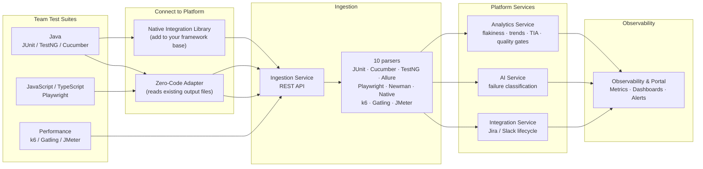

# Scaling Test Automation: From Framework to Platform

**Time slot:** 07:30 PM – 08:15 PM
**Talk:** 40 minutes (07:30 PM – 08:10 PM)
**Q&A:** 5 minutes (08:10 PM – 08:15 PM)

---

## 1) Opening

*Scaling Test Automation: From Framework to Platform*

- You've built great test frameworks. Tests run. Teams are productive.
- But at org scale, something breaks — and it isn't a test.
- Tonight: what breaks, why, and how a platform mindset fixes it.

---

## 2) Agenda

*What we'll cover in 40 minutes*

1. The scaling problem — what frameworks can't solve alone
2. Building the right framework foundation
3. From framework to platform — the shift
4. Platform architecture walkthrough
5. The open-source stack — what runs behind the scenes
6. Platform capabilities — what it does with your test results
7. Demo — connecting your framework to the platform
8. Trade-offs and migration path
9. The platform as foundation for Agentic AI — generate, execute, maintain, repeat
10. Q&A

---

## 3) The Scaling Problem

*What a QA Architect actually lives with as the organisation grows*

| What you feel | What is actually missing |
|---|---|
| CI is slow and getting slower | No test selection — every run executes everything, every time |
| Flaky tests eroding trust in CI | Flakiness is invisible until it has already caused damage |
| A test goes from 2% to 20% fail rate over four weeks — nobody notices until it blocks a release | No trend line — degradation is silent without historical pass rate per test |
| Failure triage takes hours | Each team diagnoses in isolation — no cross-team pattern recognition |
| Recurring failures with no owner | No automated link between a failing test and a work item — things get missed or silently ignored |
| Can't answer "are we release-ready?" | No org-level quality signal — only team-level noise |
| "Is our quality improving?" — answered with gut feel, not data | No quarter-over-quarter baseline — progress is invisible to leadership and the team alike |
| Functional and non-functional tests live in separate worlds — no single report covers both | Teams run JUnit, Cucumber, Playwright, k6, JMeter — each produces a different format, each has its own dashboard, quality is never seen as a whole |

**The pattern underneath all of it:**

> Each team optimises locally. Quality data is trapped in silos.
> The problem is not the frameworks — it is the absence of a shared signal layer above them.

---

## 4) Building the Right Foundation

*Design your framework for scale before the platform layer*

### Three principles that matter

**1. Modular libraries, not monolithic framework jars**

Each concern is its own library — UI, Config, API, Infrastructure, Listeners. Teams pull only what they need. Downstream framework projects (TestNG, Cucumber, Robot) all share the same base with no duplication.

**2. Centralized configuration cascade**

One config resolution strategy across all environments:
```
System Properties → environment config → base config
```
No hardcoded URLs. No per-team config drift.

**3. Container-first execution**

Same test code runs on a developer laptop, Selenium Grid, and a Kubernetes pod. The runner resolves the target — test code never knows.

```text
┌─ Test Pod ───────────────────────────────────┐
│  JVM (TestNG / Cucumber / Robot)             │
│           │                                  │
│           ▼                                  │
│  Selenium Node (Chrome / Firefox)            │
└──────────────┬───────────────────────────────┘
               │ results
               ▼
        Platform Ingestion API
```

### Replicating this design to other stacks

This modular pattern is language-agnostic. With an LLM, the same architecture scaffolds in Python or TypeScript in hours — feed the existing design as the reference spec and generate the equivalent. This is how the JavaScript adapter for Playwright was built.

---

## 5) Framework vs Platform

*The platform does not replace the framework — it wraps it*

| Dimension | Test Automation Framework | Test Automation Platform |
|---|---|---|
| Primary goal | Help a team write and run tests | Provide org-wide quality intelligence |
| Scope | Test code, runner, assertions, utilities | Ingestion, analytics, AI, integrations, observability |
| Ownership | One team | Shared service across all teams |
| Data model | Per-tool format (XML, JSON, JTL) | Unified schema — every framework, one pipeline |
| Output | Pass / fail per run | Trends, flakiness scores, alerts, ticket lifecycle |
| Failure handling | Manual triage | Automated classification + workflow automation |
| Performance data | Separate load test reports | Same pipeline as functional tests |
| Test selection | Run everything, every time | Test Impact Analysis — run only what matters |

**The framework is one layer. The platform adds the layers above it.**

---

## 6) Why Move Now

*You outgrow framework-only mode at a predictable point*

Move when you see **three or more** of these:

- Multiple teams using different test stacks (JUnit, Cucumber, Playwright, k6)
- CI runtime growing faster than the team count
- Flaky tests blocking merges more than once per week
- Failure MTTR measured in hours, not minutes
- Leadership asking for release readiness signals — not test logs
- Functional and non-functional tests reported separately — no unified quality picture

**The business shift:**
> *From "Can this team run tests?" → "Can the organisation trust quality signals?"*

---

## 7) Platform Architecture

*How the pieces connect*



---

## 8) The Stack Behind It — All Free, All Open-Source

*No vendor lock-in. Every component has a managed cloud equivalent if you need it.*

| Layer | Tool | What it does |
|---|---|---|
| **API & Services** | Spring Boot 4 · Spring WebFlux | REST APIs, async processing |
| **Message bus** | Apache Kafka (KRaft) | Decouples ingestion from analytics, AI, and integrations |
| **Primary store** | PostgreSQL 17 | Test results, flakiness scores, tickets, audit log |
| **Search & similarity** | OpenSearch 3 | Full-text failure search, k-NN root-cause grouping |
| **Cache** | Redis 8 | Quality gate results, rate limiting, session tokens |
| **Observability** | Prometheus + Grafana | Metrics, dashboards, alert rules |
| **Tracing** | OpenTelemetry + Jaeger | Distributed trace per test run |
| **Containerisation** | Docker Compose → Kubernetes + Helm | Same config from laptop to prod |
| **CI integration** | GitHub Actions · GitLab CI · Jenkins | TIA filters, result upload, quality gates |

> **The platform runs on a developer laptop with one command:** `docker compose --profile services up -d`

---

## 9) Two Ways to Connect Your Framework

*Choose based on how much you want to change*

| | Native Integration Library | Zero-Code Adapter |
|---|---|---|
| **What it is** | Add to your framework base — deep, native integration | Reads existing report output files — no test code changes |
| **Code change** | Add one dependency to your framework base; optional annotations on tests | Register one listener / extension / reporter |
| **What you get** | Step tracking, distributed tracing, retry, coverage annotations, failure hints | Automatic upload of existing XML / JSON report files |
| **Best for** | New frameworks or teams wanting full observability | Existing projects with no appetite for code change |
| **Language** | Java today · Python, JavaScript planned | Java · JavaScript / TypeScript |

**Rule of thumb:** start with the zero-code adapter today, migrate to the native library when you want richer data.

---

## 10) What the Platform Does With Your Test Results

*Capabilities across four service areas*

### Flakiness & Trends
- Scores every test: Stable · Watch · Flaky · Critical Flaky
- Tracks pass rate, duration, and failure patterns over time
- Org-wide dashboard across all teams and frameworks

### Test Impact Analysis
- Maps each test to the production code it covers
- At PR time: "of 340 tests, only 12 need to run — 96.5% reduction, LOW risk"
- Outputs ready-to-use filter commands for Maven and Gradle

### Quality Gates & Alerts
- Configurable thresholds: max failure rate, max flaky %, min pass rate
- Alert channels: email, Slack, webhook
- Release report: go / no-go signal per environment

### Automated Ticket Lifecycle
- Confirmed application bug with repeated failures → creates Jira Bug automatically
- Test with rising flakiness → creates Test Maintenance ticket
- Test back to green → closes the ticket (opt-in per team)
- Deduplication groups the same root cause into one ticket, not many

---

## 11) Performance Tests in the Same Pipeline

*k6, Gatling, and JMeter — first-class citizens*

Teams submit load test results alongside functional tests. No separate dashboard. No manual comparison.

| Tool | How to submit | What becomes a test case |
|---|---|---|
| k6 | `--summary-export=summary.json` + HTTP POST | Each `check` in a group |
| Gatling | Upload `stats.json` from simulation report | Each `REQUEST` entry |
| JMeter | Upload `results.jtl` from test plan | Each unique label (sampler name) |

**Same flakiness scoring, same quality gates, same Jira integration.**

A load test that starts failing 5% of the time shows up in the flakiness dashboard — no extra configuration.

---

## 12) AI — Where It Helps and Where It Hurts

*Honest assessment*

### Where it accelerates
- Pre-classifies failures before a human looks — bad locator, timing issue, infrastructure noise, or real application bug
- Groups failures by root cause similarity — 50 identical errors become 1 incident ticket
- Suggests likely fix based on stack trace and test step context
- Scaffolds new framework modules in Python or TypeScript in one prompt pass

### Where it can hurt
- Cost spikes if every failed test triggers an AI API call
- Hallucinated root causes on noisy or truncated stack traces
- False confidence when AI classifies a test as flaky but it is a real regression

### Guardrails in this platform
- Real-time analysis is **opt-in per project** — teams enable it when they are ready
- Prompts are bounded — stack trace and run history are capped to control cost and noise
- Re-runs never create duplicate analyses — results are idempotent

---

## 13) Demo

*End-to-end: from test run to platform insight*

### What we'll show

1. Connect an existing framework with **`platform-adapters`** — zero code change
2. Add **`platform-testkit-java`** to a framework base for native step tracking
3. Run tests, watch results appear in the portal
4. Trigger Test Impact Analysis on a changed file
5. Submit a k6 load test result into the same pipeline

---

### Demo A — Zero-Code Connection (`platform-adapters`)

*For teams that don't want to touch test code*

**Java — register the adapter once:**

```xml
<!-- pom.xml — test scope only -->
<dependency>
    <groupId>com.platform</groupId>
    <artifactId>platform-adapter-java</artifactId>
    <version>${platform.version}</version>
    <scope>test</scope>
</dependency>
```

```java
// JUnit 5: one annotation on the base class, or register globally via ServiceLoader
@ExtendWith(PlatformReportingExtension.class)
class BaseTest {}

// TestNG: register in testng.xml
// <listeners><listener class-name="com.platform.sdk.testng.PlatformTestNGListener"/></listeners>

// Cucumber: add plugin to @CucumberOptions
// plugin = {"com.platform.sdk.cucumber.PlatformCucumberPlugin"}
```

```bash
# CI — set env vars, run as normal, adapter uploads automatically
PLATFORM_URL=http://platform:8081
PLATFORM_API_KEY=plat_...
PLATFORM_TEAM_ID=team-payments
PLATFORM_PROJECT_ID=proj-checkout
```

**Playwright (JS/TS) — one line in playwright.config.ts:**

```typescript
reporter: [
  ['list'],
  ['@platform/adapter-playwright', {
    endpoint:  process.env.PLATFORM_URL,
    apiKey:    process.env.PLATFORM_API_KEY,
    teamId:    'team-frontend',
    projectId: 'proj-checkout-e2e',
    // branch, commitSha, ciRunUrl — auto-detected from CI env
  }],
],
```

---

### Demo B — Native Integration (`platform-testkit-java`)

*For teams that want step tracking, tracing, and coverage annotations*

**Add to your framework base pom — not to individual test projects:**

```xml
<dependency>
    <groupId>com.platform</groupId>
    <artifactId>platform-testkit-java</artifactId>
    <version>${platform.version}</version>
</dependency>
```

**Your framework base class wires it in — test authors see nothing new:**

```java
// Your existing base class in test-automation-fwk
public abstract class BaseUITest extends PlatformBaseTest {
    protected WebDriver driver;

    @BeforeEach void setUp() {
        driver = BrowserFactory.CHROME.createDriver(); // your existing setup
    }
}
```

**Test authors get structured steps, retry, and coverage declarations for free:**

```java
// test-cucumber-framework — step definition
public class CheckoutSteps {
    private final TestLogger log = TestLogger.forClass(CheckoutSteps.class);

    @When("the user completes checkout")
    @AffectedBy("com.example.CheckoutService")   // ← declares TIA coverage mapping
    public void completeCheckout() {
        log.step("Fill shipping address");
          shippingPage.fill(address);
        log.endStep();

        log.step("Submit payment");
          paymentPage.pay(card);
        log.endStep();
    }
}
```

**TestNG — same pattern:**

```java
@Test
@Retryable(maxAttempts = 3)                       // ← retry with attempt tracking
@AffectedBy("com.example.LoginService")           // ← TIA coverage
public void userCanLogin() {
    log.step("Navigate to login page");
      driver.get(baseUrl + "/login");
    log.endStep();

    log.step("Submit credentials and verify dashboard");
      loginPage.login(user, pass);
      softly(s -> s.assertThat(driver.getTitle()).contains("Dashboard"));
    log.endStep();
}
```

---

### Demo C — Test Impact Analysis

```bash
# At PR time: which tests cover the changed files?
curl "http://localhost:8082/api/v1/analytics/proj-checkout/impact?\
changedFiles=src/main/java/com/example/CheckoutService.java"

# Response:
# { "selectedTests": 12, "totalTests": 340,
#   "estimatedReduction": "96.5%", "riskLevel": "LOW",
#   "mavenFilter": "CheckoutServiceTest+OrderFlowTest" }

# Run only the relevant tests
mvn test -Dtest="CheckoutServiceTest+OrderFlowTest"
```

---

### Demo D — k6 Performance Test

```bash
k6 run --summary-export=summary.json load-test.js

curl -X POST http://localhost:8081/api/v1/results/ingest \
  -H "X-API-Key: plat_..." \
  -F "format=K6" \
  -F "teamId=team-payments" \
  -F "projectId=proj-checkout" \
  -F "file=@summary.json"

# Result appears in the portal alongside functional test runs
```

---

### Demo E — Verify in Portal and DB

```bash
# Portal
open http://localhost:8085

# Raw counts
docker exec platform-postgres psql -U platform -d platform -c "
  SELECT count(*) AS executions    FROM test_executions;
  SELECT count(*) AS results       FROM test_case_results;
  SELECT count(*) AS tia_mappings  FROM test_coverage_mappings;"
```

---

## 14) Trade-offs and Design Choices

*What we chose and why it costs something*

| Decision | Pro | Con |
|---|---|---|
| Synchronous ingest + async analytics (Kafka) | Services scale independently; ingestion never blocks on analytics | Eventual consistency — dashboards lag by seconds |
| Three data stores (PostgreSQL, OpenSearch, Redis) | Right tool per workload — relational, full-text, cache | Operational complexity; three systems to run and monitor |
| File-based adapters + native SDK (two paths) | Low adoption friction for existing projects | Schema governance required as both evolve |
| TIA via annotation, not instrumentation | Zero runtime overhead; explicit developer intent | Coverage completeness depends on team discipline |
| AI analysis opt-in per project | Cost stays predictable | Teams must opt in; early adopters carry the tuning burden |

---

## 15) Practical Migration Path

*From framework to platform — phased adoption at your own pace*

| Phase | What to do | Signal you're done |
|---|---|---|
| **Step 1** | Standardise ingestion — connect all CI pipelines to the platform via an adapter | All teams visible in the org dashboard |
| **Step 2** | Enable flakiness scoring and quality gate alerts | Teams start seeing flakiness scores; first alert fires |
| **Step 3** | Automate ticket lifecycle for critical failures | First auto-created ticket; first auto-closed ticket |
| **Step 4** | Add coverage annotations to high-value test suites; enable Test Impact Analysis | First measurable CI runtime reduction |
| **Step 5** | Submit performance test results into the same pipeline | Performance regressions visible before production |
| **Step 6** | Enable AI failure classification with guardrails | Triage time measurably reduced |

---

## 16) Key Takeaways

*What to remember from tonight*

- **Framework alone is not enough at scale** — design it modularly from day one, container-first
- **The platform does not replace your framework** — it wraps it with shared services
- **Two connection paths:** native integration library for depth, zero-code adapter for zero friction
- **Performance and functional data belong in the same pipeline** — separate dashboards are a solved problem
- **Test Impact Analysis is the highest-leverage CI optimisation** once coverage data exists
- **AI helps with volume, not with quality of your tests** — use it for triage and scaffolding, not as a crutch
- **Build this now, and you are already positioned for what comes next** — the data model, APIs, and event stream are the foundation Agentic AI will run on

---

## 17) The Next Frontier — Agentic AI in Test Automation

*The platform is not the destination — it is the foundation and the control plane*

An agent in test automation is not a smarter script. It is an autonomous loop that **generates, executes, evaluates, and maintains** tests — continuously, without human initiation.

**The platform is the control plane between agents and humans.** Agents act autonomously on routine decisions. The platform surfaces everything they do — and every signal they could not resolve — so humans can review, approve, or override with full context.

**The full agentic loop:**

```
  Production code changes
         │
         ▼
  ┌─ Generate ──────────────────────────────────────────────┐
  │  Agent reads changed code + existing test coverage      │
  │  Generates new / updated test cases                     │
  │  Opens a PR against the test repository                 │
  └─────────────────────────────────────────────────────────┘
         │
         ▼
  ┌─ Execute ───────────────────────────────────────────────┐
  │  Agent triggers CI run on the generated tests           │
  │  Results flow into the platform (ingestion API)         │
  └─────────────────────────────────────────────────────────┘
         │
         ▼
  ┌─ Evaluate ──────────────────────────────────────────────┐
  │  Platform classifies failures, scores flakiness         │
  │  Agent reads signals: pass rate, risk level, TIA impact │
  │  Decides: merge, revise, or escalate to human           │
  └─────────────────────────────────────────────────────────┘
         │
         ▼
  ┌─ Maintain ──────────────────────────────────────────────┐
  │  Flaky test detected → agent patches locator / timing   │
  │  Coverage gap detected → agent adds missing scenarios   │
  │  Obsolete test detected → agent raises removal PR       │
  └─────────────────────────────────────────────────────────┘
         │
         └──────────────────────────────► feedback loop
```

**What the platform contributes to each step:**

| Agent step | Platform signal | Human touchpoint |
|---|---|---|
| Generate | TIA coverage map — which classes lack test coverage | Review generated test PR before merge |
| Execute | Ingestion API — structured result intake from any runner | Portal shows every run, every result |
| Evaluate | Flakiness score, failure classification, quality gate verdict | Human overrides gate decision when context matters |
| Maintain | Historical trends, consecutive failure count, open ticket status | Approve or reject agent-raised maintenance PRs |

**The platform as controller — what humans see and act on:**

- **Portal dashboard** — full visibility into every action an agent took, every result it produced, every ticket it opened or closed
- **Quality gate** — the human-configurable threshold that gives agents a go / no-go signal, and flags exceptions for human review
- **Audit log** — every automated action is recorded: who (or what agent) triggered it, when, and what the outcome was
- **Escalation path** — when an agent cannot confidently classify a failure or a risk level is HIGH, the platform routes it to a human inbox rather than acting autonomously

**The shift in mindset:**

> *Today: humans write tests, the platform monitors them.*
> *Tomorrow: agents write and maintain tests, the platform is their feedback loop and the human's control panel — all in one.*

The data model, the APIs, and the event stream are already agent-ready. The question is not whether this is coming. It is whether your quality infrastructure will be ready when it does.

---

## 18) Q&A

*5 minutes — 08:10 PM to 08:15 PM*

Happy to continue the conversation offline after the session.

Prompt ideas if the room is quiet:

- What stays in team frameworks vs platform core?
- How do you phase rollout without slowing delivery?
- How do you handle TIA coverage drift when production code is refactored?
- Where should AI be gated by cost policy?
- How do you add a new report format the platform doesn't support yet?

---

## Key Terms

| Term | Full name | What it means in this talk |
|---|---|---|
| **CI** | Continuous Integration | Automated pipeline that builds and tests code on every change |
| **TIA** | Test Impact Analysis | Selects only the tests relevant to what changed — skips the rest |
| **MTTR** | Mean Time To Resolve | Average time from a failure being detected to it being fixed |
| **Flakiness** | — | A test that passes and fails intermittently without code changes |
| **Quality Gate** | — | A configurable pass / fail threshold that blocks a release if breached |
| **KRaft** | Kafka Raft | Kafka's built-in consensus mode — no separate coordination service needed |
| **k-NN** | k-Nearest Neighbours | Algorithm used to find failures with similar root causes across runs |
| **OTel** | OpenTelemetry | Open standard for capturing distributed traces across services |
| **PR** | Pull Request | A proposed code change submitted for peer review before merging |
