# System Architecture — Current State (v2.1)

> v2.0 (b4640398780f0f339bb3a9bf5e83b271ab4e1b01) through HEAD.
> Diagrams use [Mermaid](https://mermaid.js.org/) — rendered natively in GitHub, GitLab, and VS Code (Markdown Preview Enhanced).

---

## 1. System Context

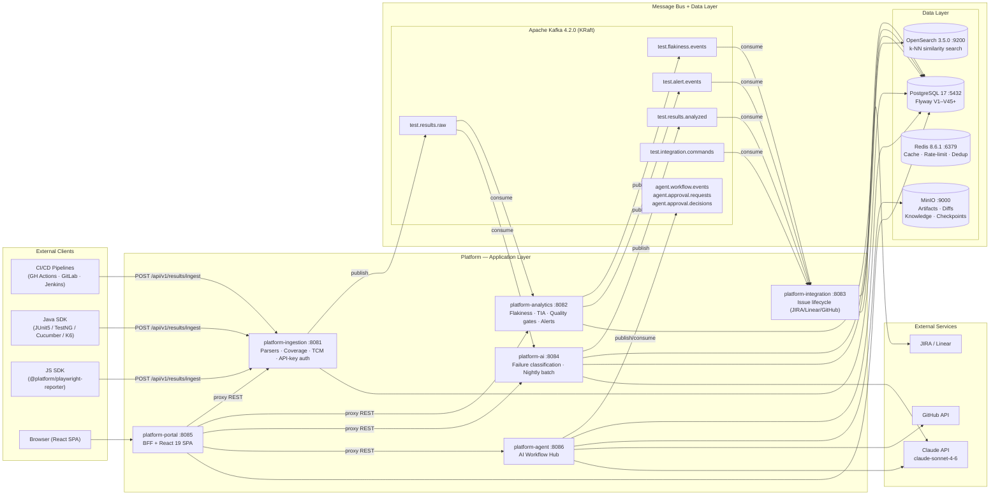

---

## 2. Agent Grid — High-Level Architecture

> Inspired by Selenium Grid: **Hub** = source-of-truth controller + task router; **Nodes** = stateless Claude-powered workers that register their capabilities and accept sessions.

```mermaid
flowchart LR
    subgraph TRIGGERS["Inbound Triggers"]
        direction TB
        GHW["GitHub Webhook<br/>PR open · sync · close"]
        JIRAW["JIRA Webhook<br/>issue update"]
        LINW["Linear Webhook"]
        SLACKI["Slack Interactions<br/>Block Kit approve/reject"]
        PORTALT["Portal<br/>manual trigger"]
        SCHED["Scheduler<br/>nightly digest · polling fallback"]
    end

    subgraph HUB["HUB — platform-agent :8086  (Source of Truth + Coordinator)"]
        direction TB

        subgraph SYNC["Source Sync Layer"]
            RSS["RequirementSyncService<br/>JIRA / Linear → platform_requirements<br/>(JIRA/LinearWebhookController + polling)"]
            CRI["CodeRepoIndex<br/>GitHub PR diffs → MinIO platform-diffs<br/>(GitHubWebhookController + polling)"]
        end

        subgraph GRAPH["Knowledge Graph"]
            GS["GraphService<br/>Requirement graph traversal<br/>(parent · linked · covered-by edges)"]
            RCP["RequirementChangeProcessor<br/>AC-level diff → NEEDS_UPDATE / OBSOLETE"]
            TPG["TestPlanGeneratorService<br/>Release scope → test plan + coverage gaps"]
        end

        subgraph CORE["Hub Core"]
            CTX["ContextAssembler<br/>Builds 5-tier ContextBundle<br/>(Req · TestCase · AutoTest · Execution · Monitor)"]
            ROUTER["CapabilityTaskRouter<br/>Matches task.requiredCapabilities<br/>to registered nodes (+ LLM tier filter)"]
            REG["NodeRegistry<br/>InMemory ConcurrentHashMap<br/>70 s heartbeat eviction"]
            WFS["AgentWorkflowService<br/>Workflow FSM · step loop<br/>review-pause · Kafka events"]
            TBG["TokenBudgetGuard<br/>Monthly per-project budget cap<br/>hard-stop before Claude call"]
        end

        subgraph REVIEW["Review Gateway"]
            RGW["KafkaReviewGateway<br/>persists AgentReviewRequest<br/>emits agent.approval.requests"]
            SLACK_N["SlackNotificationService<br/>Block Kit interactive messages"]
            PORTAL_Q["Portal Work-Items<br/>/api/portal/projects/{id}/work-items"]
        end
    end

    subgraph PROTOCOL["Hub ↔ Node Session Protocol"]
        direction TB
        P1["Node → Hub<br/>POST /hub/nodes/register<br/>(capabilities + endpoint + heartbeat)"]
        P2["Hub → Node<br/>POST /node/sessions<br/>(ContextBundle + credentials)"]
        P3["Node → Hub (live)<br/>POST /hub/sessions/{id}/step<br/>POST /hub/sessions/{id}/artifact<br/>POST /hub/sessions/{id}/complete|fail"]
    end

    subgraph NODES["NODE POOL — stateless, horizontally scalable"]
        direction TB

        subgraph NODES_ANALYSIS["Analysis & Insight"]
            ANA["AnalysisNode<br/>ANALYSE_PR_IMPACT<br/>PR diff + TIA → coverage gap<br/>Posts PR comment<br/>sonnet-4-6"]
            INS["InsightNode<br/>GENERATE_INSIGHT_DIGEST<br/>Trends + flakiness → Slack digest<br/>sonnet-4-6"]
        end

        subgraph NODES_REQUIREMENTS["Requirements"]
            EAC["ExtractAcceptanceCriteriaNode<br/>EXTRACT_ACCEPTANCE_CRITERIA<br/>Raw req → structured ACs<br/>sonnet-4-6"]
        end

        subgraph NODES_TESTGEN["Test Generation"]
            TCG["TestCaseGenerationNode<br/>GENERATE_TEST_CASES<br/>ACs + dedup context → ManagedTestCase rows<br/>sonnet-4-6"]
            TGN["TestGenNode<br/>GENERATE_TESTS_QUICK<br/>Lightweight path<br/>sonnet-4-6"]
        end

        subgraph NODES_AUTOMATION["Automation"]
            ACG["AutomationCodeGenerationNode<br/>GENERATE_AUTOMATION<br/>TestCase + linked reqs → Playwright/JUnit5 PR<br/>opus-4-7"]
            HEAL["HealingNode<br/>HEAL_FAILING_TEST<br/>Failure + test code → patch PR<br/>opus-4-7"]
        end
    end

    subgraph ORCH["Agent Orchestrator (embedded in each node)"]
        direction TB
        CLO["ClaudeAgentOrchestrator<br/>MAX_TOOL_ITERATIONS = 25<br/>Full tool-use loop · __AWAITING_REVIEW__ sentinel<br/>Model selected by LlmTier"]
        SMRZ["StepSummarizer<br/>haiku-4-5 compresses tool results<br/>8 K token diff → ~42 token summary"]
        CKPT["RedisCheckpointService<br/>TTL by ResumeStrategy<br/>prompt-cache ≤5 min · compressed ≤24 h · handoff >24 h"]
    end

    subgraph ARTIFACTS["Artifact Targets"]
        direction TB
        GH_PR["GitHub Pull Request<br/>(automation code · fixes)"]
        JIRA_T["JIRA / Linear Ticket<br/>(created · updated · closed)"]
        PG_ARTS["PostgreSQL<br/>(test cases · analyses · test plans)"]
        MN_ARTS["MinIO<br/>(diffs · checkpoints · knowledge)"]
        SLACK_T["Slack Channel<br/>(digest · approval request)"]
    end

    TRIGGERS --> HUB
    SYNC --> GRAPH
    GRAPH --> CTX
    CTX --> ROUTER
    ROUTER --> REG
    WFS --> ROUTER

    HUB --> PROTOCOL
    PROTOCOL --> NODES
    NODES --> ORCH
    ORCH --> ARTIFACTS
    ORCH --> RGW
    RGW --> SLACK_N & PORTAL_Q

    SLACKI --> SLACKI_H(["SlackInteractionController"])
    SLACKI_H --> RGW

    classDef hub fill:#dbeafe,stroke:#3b82f6,color:#1e3a5f
    classDef node fill:#dcfce7,stroke:#22c55e,color:#14532d
    classDef trigger fill:#fef9c3,stroke:#eab308,color:#713f12
    classDef artifact fill:#f3e8ff,stroke:#a855f7,color:#3b0764
    classDef orch fill:#ffedd5,stroke:#f97316,color:#7c2d12

    class HUB,CORE,SYNC,GRAPH,REVIEW hub
    class NODES,NODES_ANALYSIS,NODES_REQUIREMENTS,NODES_TESTGEN,NODES_AUTOMATION node
    class TRIGGERS trigger
    class ARTIFACTS artifact
    class ORCH orch
```

### Node Capability Matrix

| Node | Task Type | LLM Tier | Tools | Output |
|---|---|---|---|---|
| `ExtractAcceptanceCriteriaNode` | `EXTRACT_ACCEPTANCE_CRITERIA` | sonnet-4-6 | `store_acceptance_criteria`, `request_review` | Structured ACs in DB |
| `TestCaseGenerationNode` | `GENERATE_TEST_CASES` | sonnet-4-6 | `platform_query`, `store_test_case` | `ManagedTestCase` rows |
| `TestGenNode` | `GENERATE_TESTS_QUICK` | sonnet-4-6 | `platform_query`, `store_test_case` | `ManagedTestCase` rows |
| `AnalysisNode` | `ANALYSE_PR_IMPACT` | sonnet-4-6 | `github_get_pr_diff`, `platform_get_tia_impact`, `github_post_pr_comment` | PR comment + `ImpactAnalysis` |
| `AutomationCodeGenerationNode` | `GENERATE_AUTOMATION` | opus-4-7 | `platform_query`, `github_create_pr` | GitHub PR with test code |
| `HealingNode` | `HEAL_FAILING_TEST` | opus-4-7 | `github_read_file`, `github_commit_file`, `github_create_pr` | Fix PR |
| `InsightNode` | `GENERATE_INSIGHT_DIGEST` | sonnet-4-6 | `platform_get_trends`, `platform_get_flakiness_leaderboard` | Slack digest |

---

## 3. Agent Hub — Internal Detail

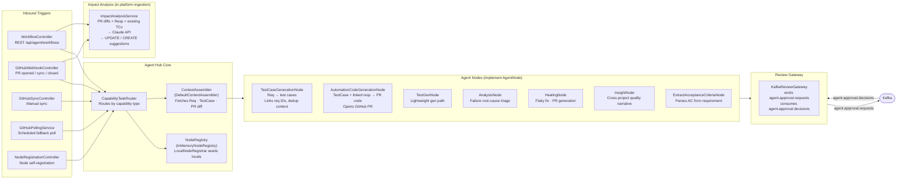

---

## 4. Test Execution Event Flow

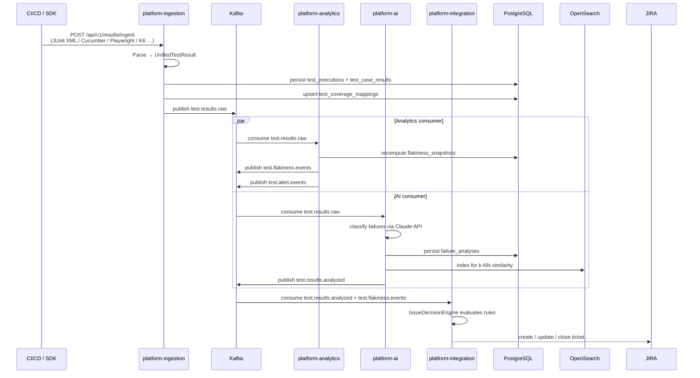

---

## 5. AI-Assisted Test Case Lifecycle

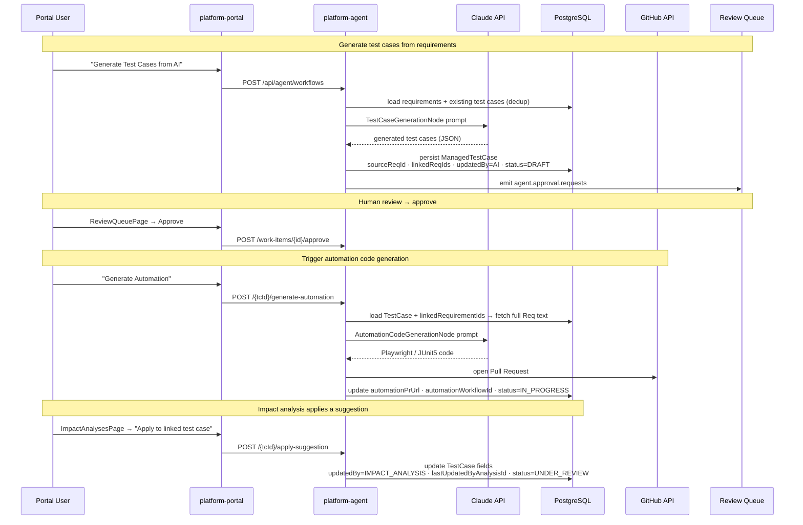

---

## 6. Test Case State Machine

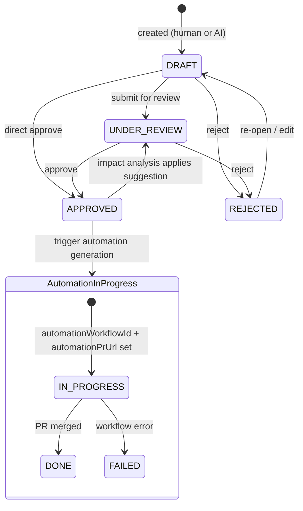

---

## 7. Test Case Linkage Model

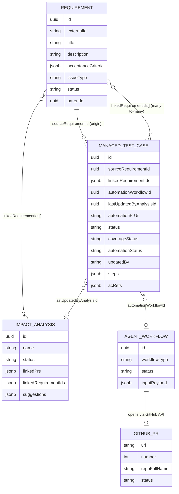

---

## 8. Portal — Page Map

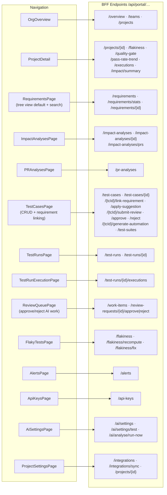

---

## 9. Observability Stack

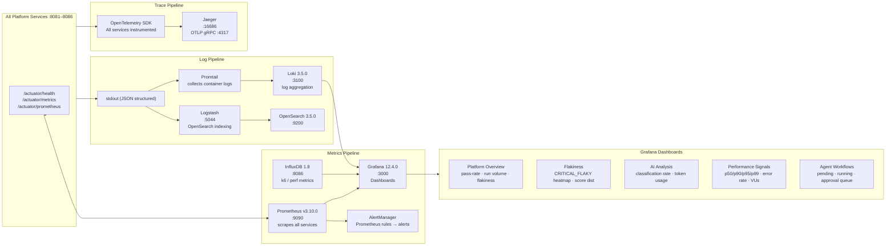

---

## 10. Deployment Topology

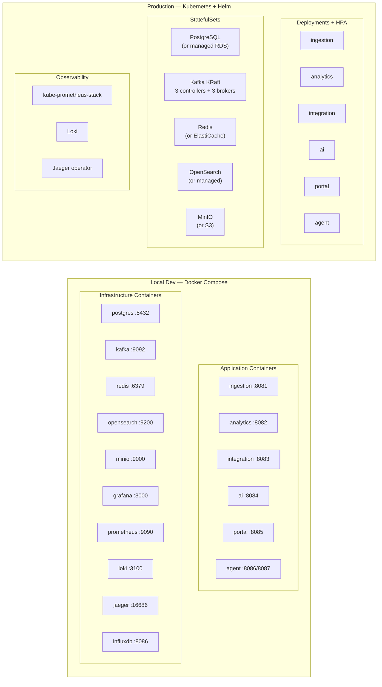

---

## 11. LLM Provider Flexibility & Self-Hosted Models

> Replacing cloud LLM calls with a self-hosted model is the primary lever for reducing per-token costs.
> The platform has a provider-abstraction layer already in place for failure classification (`platform-ai`);
> the agent orchestrator (`platform-agent`) currently uses the Anthropic SDK directly and needs an additional path.

### 11.1 Current Provider Abstraction (`platform-ai`)

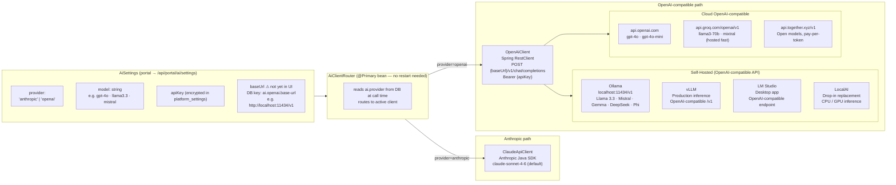

**What works today** — change `ai.provider` to `openai` in AI Settings and point `ai.openai.base-url` directly in `platform_settings` (DB) to any OpenAI-compatible server. No service restart needed.

**Remaining gap** — `AiSettings` UI and `AiSettingsUpdate` DTO do not yet expose a `baseUrl` field; it must be set directly in the database until the portal form is extended.

---

### 11.2 Agent Orchestrator (`platform-agent`)

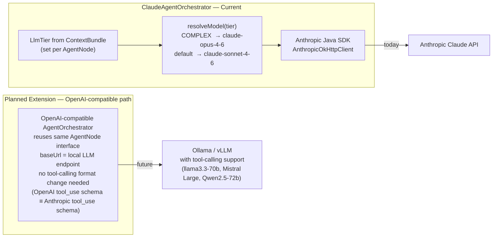

**Current state** — `ClaudeAgentOrchestrator` exclusively uses the Anthropic SDK.
Extending it requires implementing a second orchestrator that speaks the OpenAI Chat Completions format, then selecting it via `LlmTier` or a new `ai.agent.provider` setting.

> Not all local models support tool use reliably. Models known to work: **Llama 3.3 70B**, **Mistral Large 2**, **Qwen 2.5 72B**, **DeepSeek-R1 32B+**.

---

### 11.3 Cost Tier Mapping

| Task | Node | Current Model | Local Alternative | Tool Use Required | Notes |
|---|---|---|---|---|---|
| AC extraction | `ExtractAcceptanceCriteriaNode` | sonnet-4-6 | Mistral 7B · Llama 3.2 3B | Yes (simple) | Structured output, low complexity |
| Test case generation | `TestCaseGenerationNode` | sonnet-4-6 | Llama 3.3 70B · Mistral Large | Yes | Quality matters — use ≥ 30B param model |
| PR impact analysis | `AnalysisNode` | sonnet-4-6 | Llama 3.3 70B · Qwen 2.5 72B | Yes | Needs code reasoning |
| Insight digest | `InsightNode` | sonnet-4-6 | Mistral 7B · Gemma 3 12B | Yes | Narrative generation, tolerates degradation |
| Automation code gen | `AutomationCodeGenerationNode` | opus-4-7 | Llama 3.3 70B · Qwen 2.5 72B | Yes | Complex coding; test output quality before switching |
| Test healing | `HealingNode` | opus-4-7 | Llama 3.3 70B · DeepSeek-R1 32B | Yes | Complex reasoning; test output quality before switching |
| Step summarisation | `StepSummarizer` | haiku-4-5 | Gemma 3 1B · Phi-4 Mini | No | Pure text compression, any fast model works |
| Failure classification | `FailureClassificationService` | sonnet-4-6 | Mistral 7B · Llama 3.2 3B | No | Via `AiClientRouter`; works today with `provider=openai` |

---

### 11.4 Recommended Local Setup (Ollama)

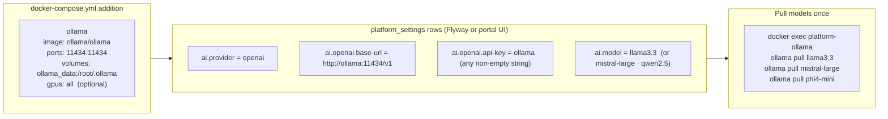

**Cost comparison (approximate, 1 M tokens):**

| Provider | Input | Output |
|---|---|---|
| Claude sonnet-4-6 | $0.30 | $1.50 |
| Claude opus-4-7 | $1.50 | $7.50 |
| OpenAI gpt-4o | $2.50 | $10.00 |
| Ollama (self-hosted GPU) | ~$0.00 | ~$0.00 |
| Groq (hosted, llama3-70b) | $0.059 | $0.079 |

---

*Last updated: v2.1 — test case linkage tracking (V45 migration), ReviewQueue page, impact analysis apply-suggestion flow, requirements tree-view default with search, LLM provider flexibility.*
