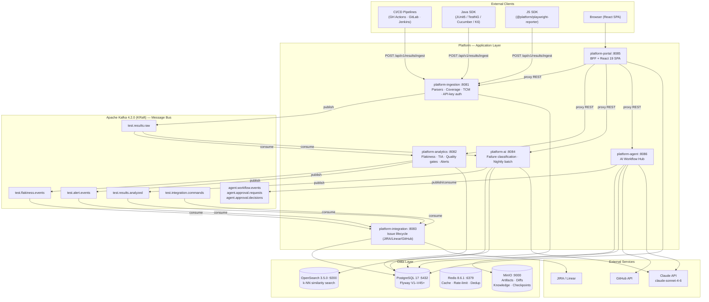
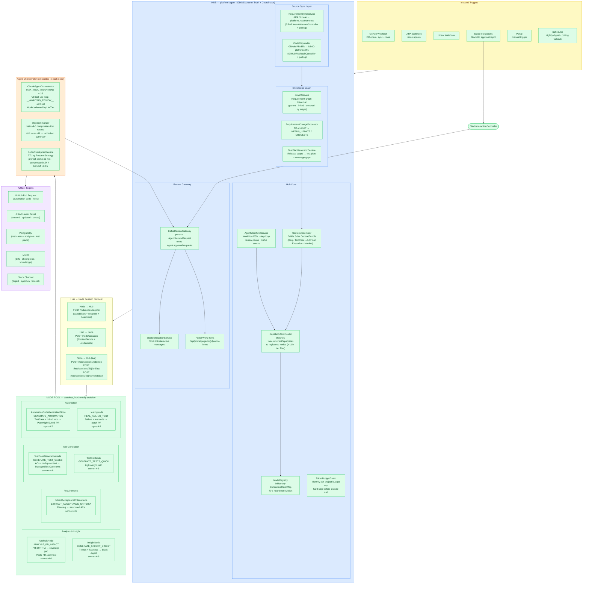
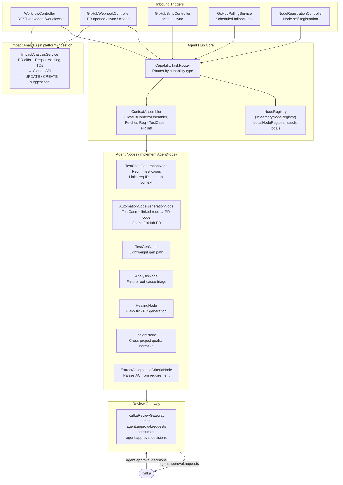
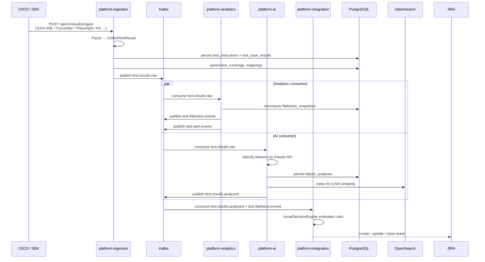
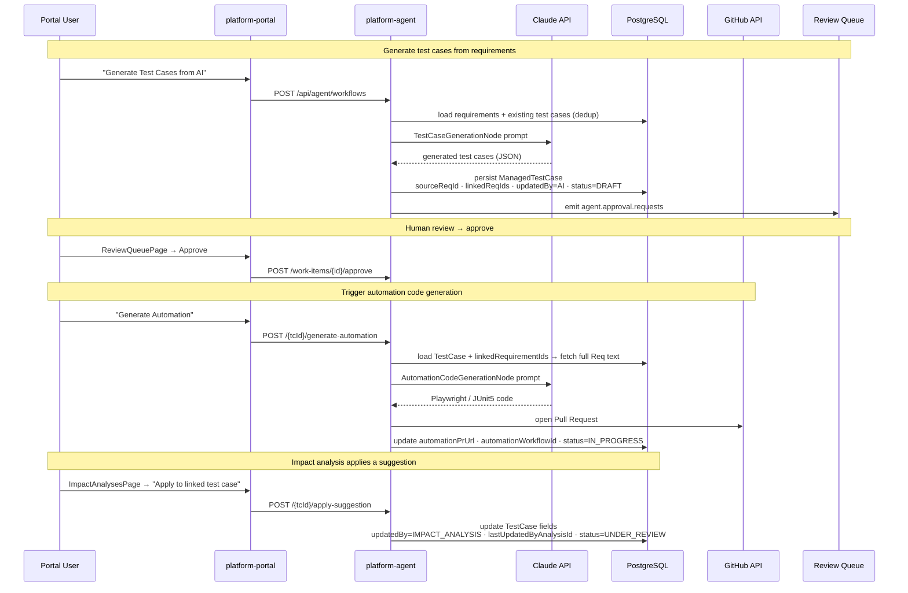
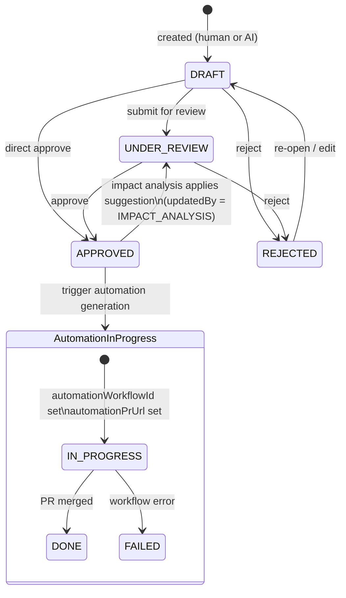
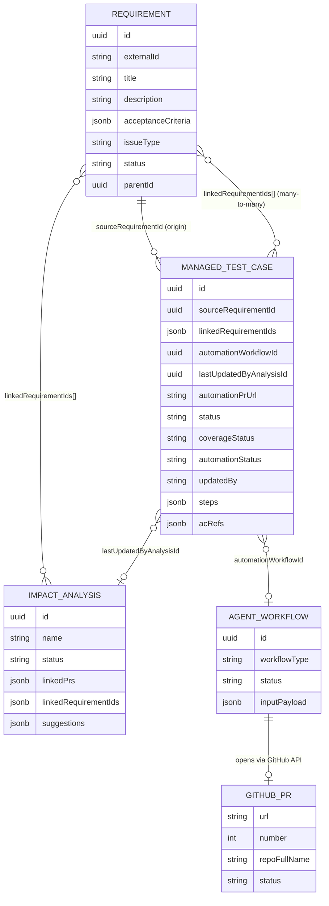
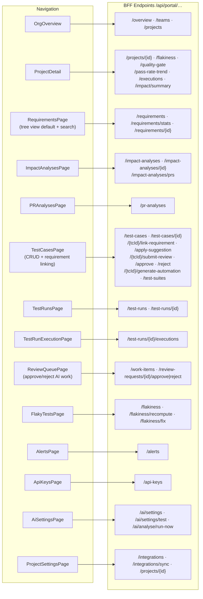
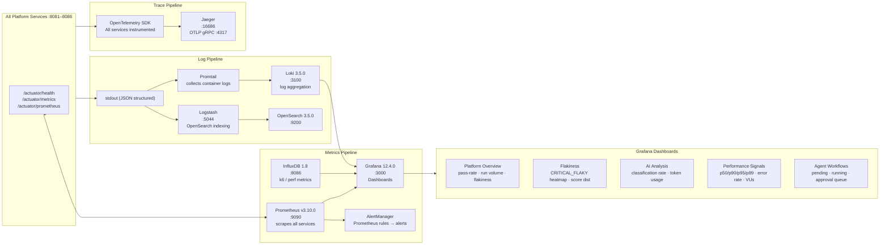
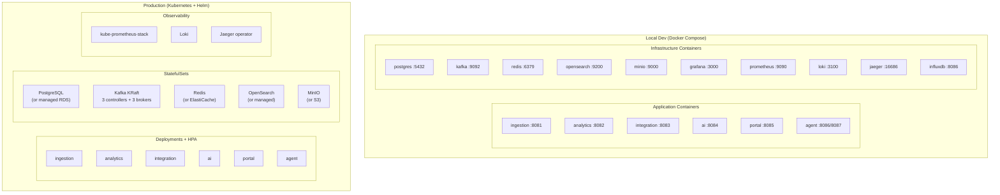

# System Architecture — Current State (v2.1)

> v2.0 (b4640398780f0f339bb3a9bf5e83b271ab4e1b01) through HEAD.
> Diagrams use [Mermaid](https://mermaid.js.org/) — rendered natively in GitHub, GitLab, and VS Code (Markdown Preview Enhanced).

---

## 1. System Context

---

## 2. Agent Grid — High-Level Architecture

> Inspired by Selenium Grid: **Hub** = source-of-truth controller + task router; **Nodes** = stateless Claude-powered workers that register their capabilities and accept sessions.

### Node Capability Matrix

| Node | Task Type | LLM Tier | Tools | Output |
|---|---|---|---|---|
| `ExtractAcceptanceCriteriaNode` | `EXTRACT_ACCEPTANCE_CRITERIA` | sonnet-4-6 | `store_acceptance_criteria`, `request_review` | Structured ACs in DB |
| `TestCaseGenerationNode` | `GENERATE_TEST_CASES` | sonnet-4-6 | `platform_query`, `store_test_case` | `ManagedTestCase` rows |
| `TestGenNode` | `GENERATE_TESTS_QUICK` | sonnet-4-6 | `platform_query`, `store_test_case` | `ManagedTestCase` rows |
| `AnalysisNode` | `ANALYSE_PR_IMPACT` | sonnet-4-6 | `github_get_pr_diff`, `platform_get_tia_impact`, `github_post_pr_comment` | PR comment + `ImpactAnalysis` |
| `AutomationCodeGenerationNode` | `GENERATE_AUTOMATION` | opus-4-7 | `platform_query`, `github_create_pr` | GitHub PR with test code |
| `HealingNode` | `HEAL_FAILING_TEST` | opus-4-7 | `github_read_file`, `github_commit_file`, `github_create_pr` | Fix PR |
| `InsightNode` | `GENERATE_INSIGHT_DIGEST` | sonnet-4-6 | `platform_get_trends`, `platform_get_flakiness_leaderboard` | Slack digest |

---

## 3. Agent Hub — Internal Detail

---

## 4. Test Execution Event Flow

---

## 5. AI-Assisted Test Case Lifecycle

---

## 6. Test Case State Machine

---

## 7. Test Case Linkage Model

---

## 8. Portal — Page Map

---

## 9. Observability Stack

---

## 10. Deployment Topology

---

*Last updated: v2.1 — test case linkage tracking (V45 migration), ReviewQueue page, impact analysis apply-suggestion flow, requirements tree-view default with search.*
